# Jarkom-Modul-1-D01-2022

### Kelompok D01

<table>
    <tr>
        <th>No</th>
        <th>Nama</th>
        <th>NRP</th>
    </tr>
    <tr>
        <td>1</td>
        <td>Ananda Hadi Saputra </td>
        <td>5025201148</td>
    </tr>
    <tr>
        <td>2</td>
        <td>Nethaneel Patricio Linggar</td>
        <td>5025201180</td>
    </tr>
    <tr>
        <td>3</td>
        <td>Yehezkiel Wiradhika</td>
        <td>5025201086</td>
    </tr>
</table>

## Soal 1

Masuk dalam file soal nomor 1 lalu ketikkan "http.host == monta.if.its.ac.id", maka kan langsung muncul package yang dibutuhkan
 

Package

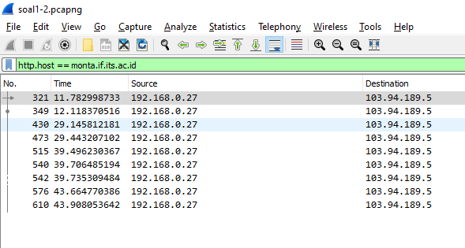

Pilih salah satu package lalu lakukan "Follow TCP Stream" maka akan muncul hasilnya
 

Hasil

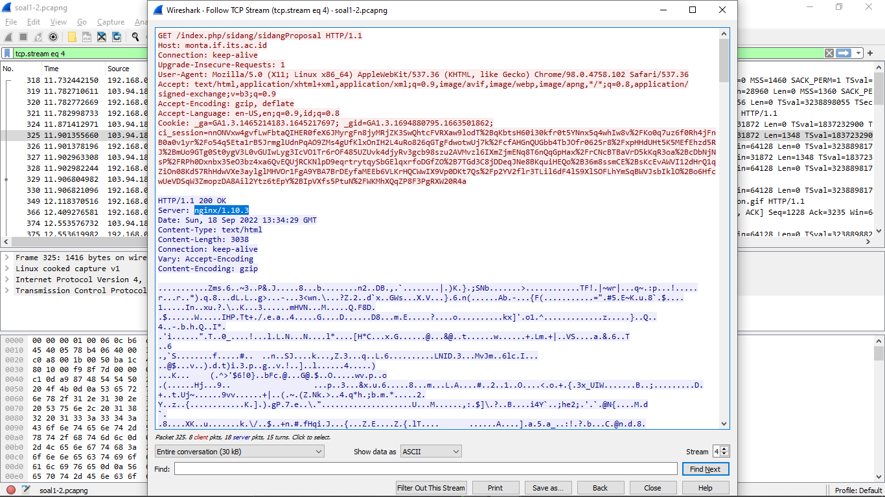

## Soal 2

## Soal 3

Filter sehingga hanya menampilkan paket yang menuju port 80

 

Filter

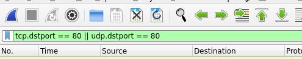
 

Hasil

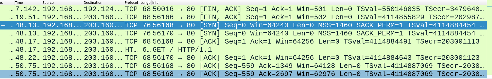

## Soal 4

Filter dan tampilkan hanya paket yang berasal dari port 21

 

Filter

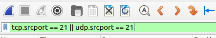
 

Hasil

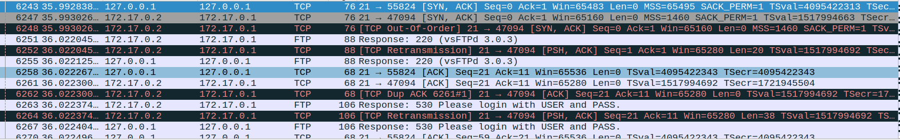

## Soal 5

Filter dan tampilkan hanya paket yang berasal dari port 443

 

Filter

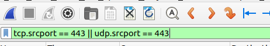
 

Hasil

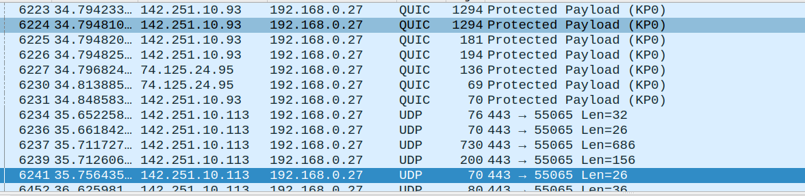

## Soal 6

Filter dan tampilkan hanya paket yang menuju lipi.co.id

 

Filter

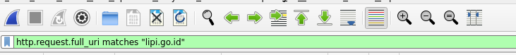
 

Hasil Filter

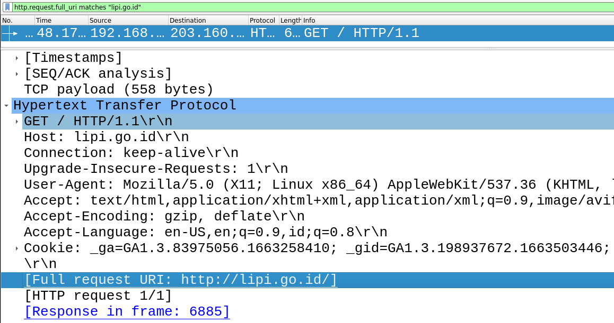

## Soal 7

Filter dan capture hanya paket yang berasal dari ip kita

 

Mencari ip address kita sendiri melalui terminal linux dengan command “ip addr”

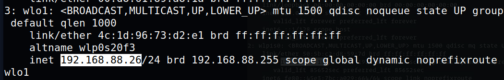
 

Melakukan capture hanya paket yang berasal dari ip kita

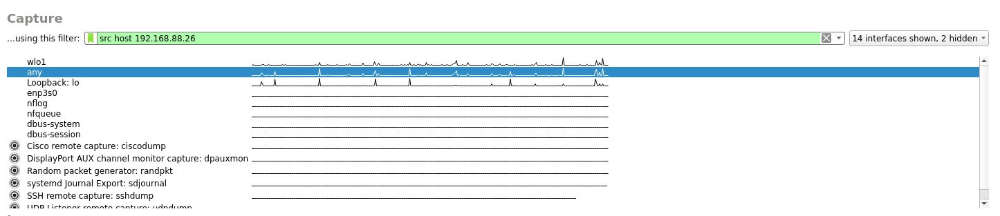
 

Hasil Capture

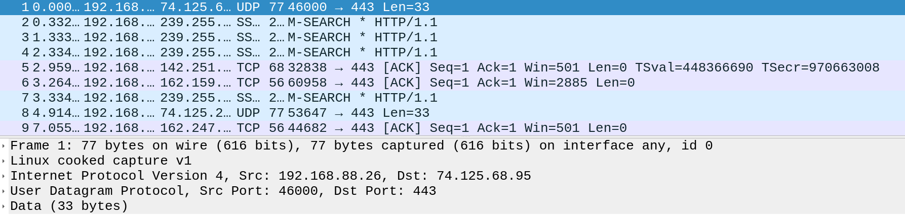

## Soal 8

## Soal 9

Berdasarkan percakapan, file saltnya berada di port 9002.

 

Kemudian kita melihat data tersebut di Export Packet Bytes

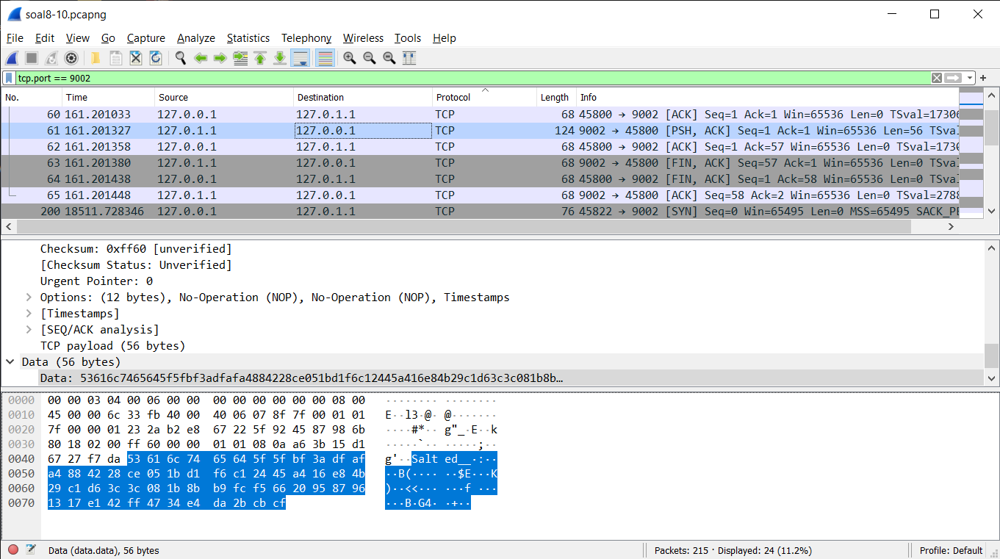
 

File tersebut lalu disimpan dengan nama D01.des3

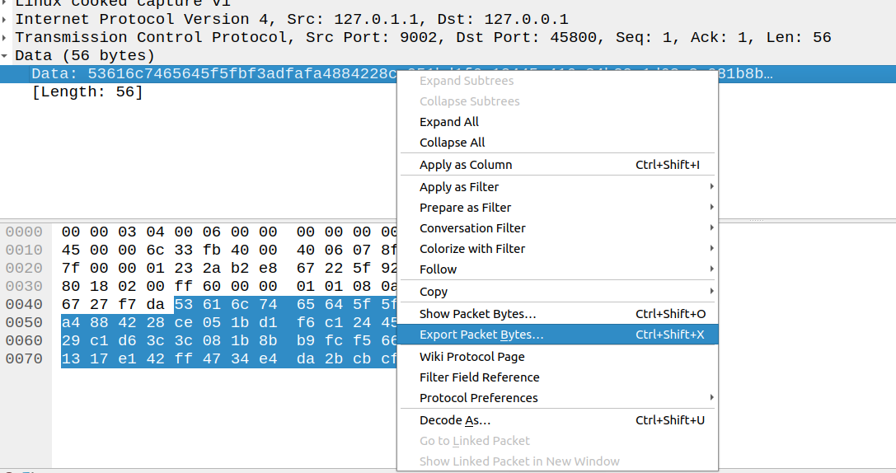
 

Hasil export file

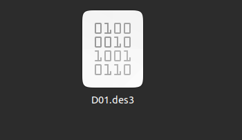
 

Output file dengan terminal dan menamainya dengan flag.txt

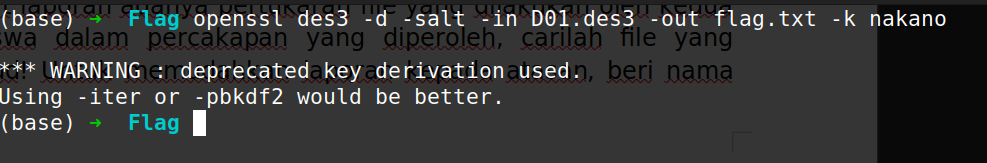
 

File dalam folder tersebut

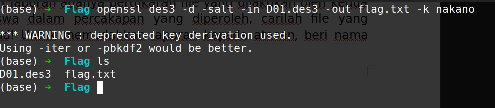

## Soal 10

Password rahasia

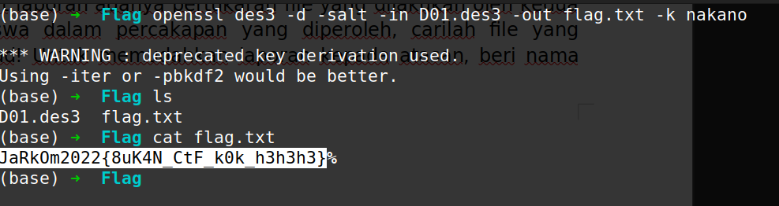
